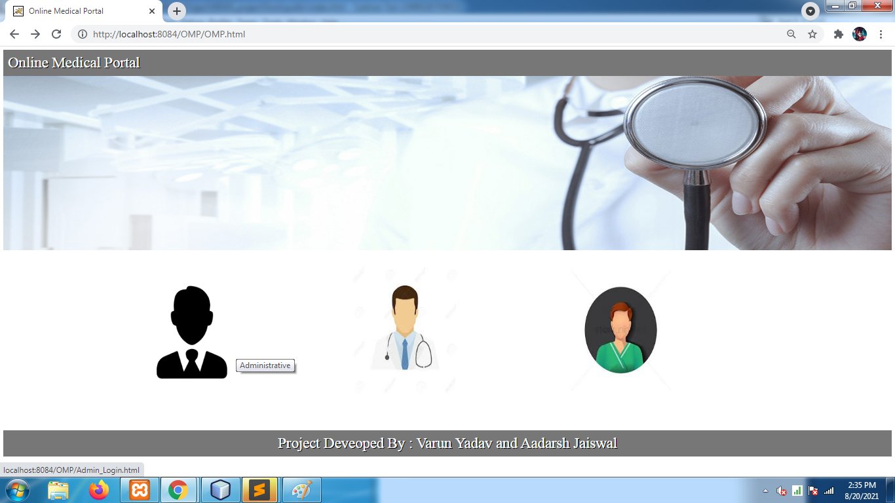
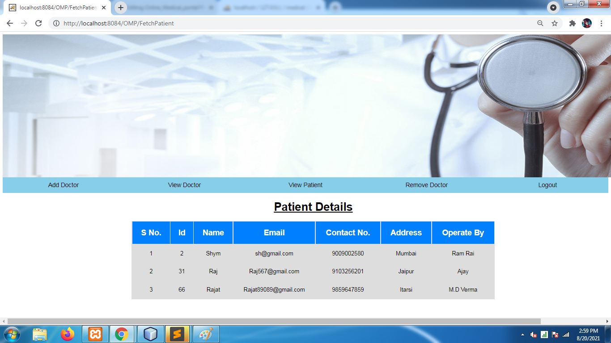
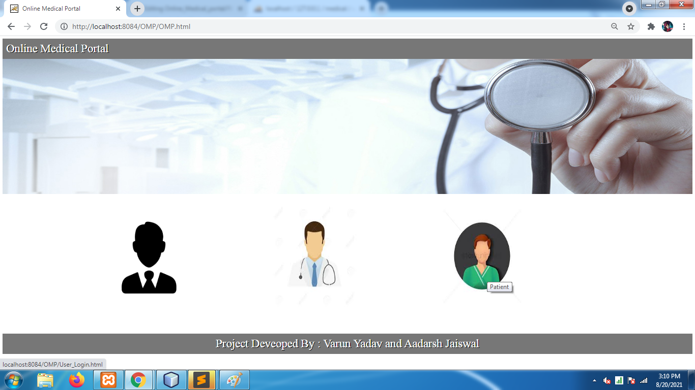

# Online_Medical_portal
<h2> Objective</h2>

A software which is help to take appointment from doctor.This software is useful in hopitals and big clinic doctor's.Patient can also see their descriptions given by Doctor.Admin can add and remove Doctor's name and details. 
  

<h2> Users of System</h2>

1. Admin 
  2. Doctor 
  3. Patient 
  

  

  <h2>
  Admin</h2>
  

  1. Can Login and Logout. 
  2. Can add Doctors. 
  3. Can view Doctors. 
  4. Can view Patient details with operated by doctor_name. 
  5. Can remove Doctors. 
  
  

  <h2>Doctor</h2>
  

  1. Can Login and Logout.
  2. Can view their profile. 
  3. Can check their Appointments. 
  4. Can search Patient with help of patient_id. 
  5. Can Add description followed by patient_id. 
  

  <h2>Patient</h2>
  

  1. Can Register yourself. 
  2. Can Login and Logout. 
  3. Can view their profile. 
  4. Can take Appointment. 
  5. Can cancel Booked Appointment. 
  6. Can search Doctors with help of doctor_name 
  

<h2>Tools Used</h2>
  1. Netbeans. 
  2. MYSQL Database 
  
<h2>Working of Project With Screenshots<h2>
  <!--78954-->
  <h4>Home Page of Our Website</h4>
  
  <h4>Admin Login Page</h4>
  
  <h4>If EmailId or Password is Incorrect.</h4>
  
  <h4>And Again Redirect to Admin Login Page.</h4>
  
  <h4>Home Page of Admin Module.</h4>
  
  <h4>If Admin select 'Add Doctor' then form will come.</h4>
  
  <h4>Fill all the fields its Mandatory then click on 'Add Doctor' button which is situated in bottom of page.</h4>
  
  <h4>After clicking on 'Add Doctor' button,alert will show and they give acknowledge about 'Doctor Added Successfully' or NOT.</h4>
  
  <h4>When Admin Click on 'View Doctor',a table will show information about doctors.</h4>
  
  <h4>When Admin Click on 'Remove' According to id doctor is remove/delete from the database,In that image i will use Name:'Dhiraj'.</h4>
  
  <h4>It give acknowledge about doctor is remove or not.</h4>
  
  <h4>That 'id' doctor is removed from the list of doctor_details</h4>
  
  <h4>Whne Admin Click on 'View Patients'</h4>
  
  <h4>When Admin Click on 'Remove Doctor',Admin Can choose doctor with the help of unique 'doctor_id' </h4>
  
  <h4>In ScreenShot We Use Id:123456797 and click on 'Delete' button</h4>
  
  <h4>It give acknowledge about 'Doctor Deleted'</h4>
  
  <h4>In Next Image name:'Harry' is not in doctor_details table because we deleted in previous Step</h4>
  
  <h4>When Admin click on 'Logout'</h4>
  
  <h4>It redirect to home page of website, And next we can login as 'Doctor'</h4>
  
  <h4>Doctor Login page</h4>
  
  <h4>If EmailId or Password is Incorrect</h4>
  
  <h4>Again redirect to Doctor Login Page</h4>
  
  <h4>If Doctor enter correct EmailId and Password,redirect to Doctor's Home Page </h4>
  
  <h4>When Doctor click on 'My Details'</h4>
  
  <h4>When Doctor click on 'My Appointments'</h4>
  
  <h4>When Doctor click on 'Search Patient',they can select patient with the help of 'Patient_id'</h4>
  
  <h4>In next image,I select (patient_id:45 and patient_name:'Naman') and hit on 'Search' button </h4>
  
  <h4>Website give informatioon about that patient</h4>
  
  <h4>When Doctor click on 'Add Description',they can select Patient with help of 'Patient_id'</h4>
  
  <h4>Doctor can Add description in the form of Treatment and Note,and click on 'Add'</h4>
  
  <h4>It give alert 'Description Added Successfully' acoording to 'Patient_id'</h4>
  
  <h4>When Doctor click on 'Logout' </h4>
  
  <h4>It will redirect to home page of website,Letsgo for understanding Patient Module</h4>
  
  <h4>Patient Login Page</h4>
  
  <h4>If EmailId or Password is Incorrect</h4>
  
  <h4>Again,Redirect to Patient Login Page</h4>
  
  <h4>For new Patient Registration Form </h4>
  
  <h4>Then,Redirect to Patient Login Page</h4>
  
  <h4>Home Page of Patient Module After successfully Login </h4>
  
  <h4>When Patient click on 'My Details'</h4>
  
  <h4>When Patient click on 'Book Appointment'</h4>
  
  <h4>Acknowledge about Appointment Booked or not </h4>
  
  <h4>When Patient click on 'Cancel Booking'</h4>
  
  <h4>Acknowledge about Appointment is Cancel</h4>
  
  <h4>When Patient click on 'Search Doctor' with the help of 'Doctor_Name'</h4>
  
  <h4>It Show the details about doctor like:- Id,Name,Category</h4>
  
  <h4>When Patient click on 'Logout'</h4>  
  
  <h4>Again,redirect to Home Page of Website</h4>
  
